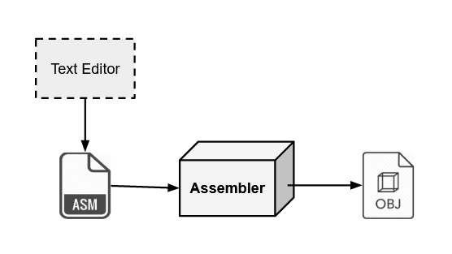
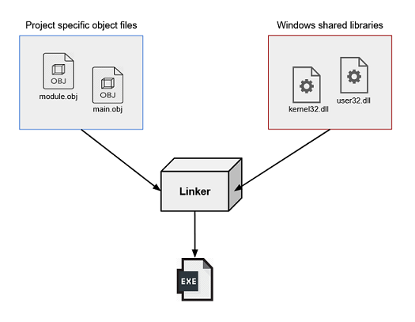

This is a short overview of the x86 assembly instruction set in a windows environment for complete *beginners*. We will tediously walk through a "helloworld" program to cover how windows functions can be called in assembly. While most native applications (.exe) are written in high level languages like C/C++ and compiled to machine code, their resulting executables can easily be disassembled. Knowledge of assembly language will allow you to make your high level code faster, reverse engineer complex executables including malware, and write low level functionality like boot loaders. Like all complex topics, the basics come first and there is a lot to unpack when programming without many layers of abstraction.

#### *Resources*

Its important to gain a grasp of some of the instructions used, CPU registers, and binary encoding before continuing. I recommend reading the following guides if this is your first time seeing assembly. 

- [cs.virginia.edu general guide](http://www.cs.virginia.edu/~evans/cs216/guides/x86.html)
- [wiki book](https://en.wikibooks.org/wiki/X86_Assembly/Print_Version)
- Don't wanna read? - there are good YouTube guides out there!

#### *Starting out*

x86 represents an instruction set and CPU architecture used by Intel processors. Windows 10 supports both 32 bit and 64 bit instructions, referred to as x86 and x86_64 respectfully. The 32 bit version is a core subset of its 64 bit successor and Windows has strong backwards compatibility. Because of this, many applications still ship 32 bit versions. We will be working with 32 bit instructions in this overview, but it is easy to extend to 64 bit.

###### Assembling: 

A program written in assembly is still an abstraction away from its final machine code form. The instructions need to be "assembled" into machine code specific to a CPU using an *assembler*. An assembler is nothing more than a program that can translate assembly instructions into relevant machine opcodes. Most x86 assemblers also optimize instructions for increased speed.  

Various assemblers have different syntaxes and features, but all have the ability to produce machine code given assembly instructions. This initially generated machine code is called an object file (`.obj`), which is usually not directly executable. This intermediate object code form can later be *linked* with operating system specific libraries to create a native executable. 

{: .align-center}

###### Linking:

Object files enable modular software that is efficient, easy to troubleshoot and update, and usually faster. In practice, software development involves compiling languages like C/C++ or assembling as previously mentioned to an object file that contains code that may depend on the other files. Since software by nature is constantly fixed and updated, instead of recompiling the entire project, it is much easier to update and recompile a specific object file and then *link* it back together with the others. This is the purpose of the *linker*.

In addition to resolving your project specific object file dependencies, the linker will need to load code from the operating system in order to run natively. An OS like Windows provides functionality for running applications through the use of shared library's. Windows utilizes **Dynamically Linked Libraries** to provide code and data to more than one program at a time - [DLL info](https://support.microsoft.com/en-us/help/815065/what-is-a-dll).

DLLs provide shared access to winAPI functions. The most used by programs are the `kernel32.dll`, `user32.dll`, and `ntdll.dll` DLLs. These provide access to commonly used functions that we can use to write condensed programs. 

Now with pretext we can fully understand the linker that creates a final executable:

{: .align-center}

###### What we will use:

- [NASM (Networkwide Assembler)](https://www.nasm.us/doc/): Popular cross-platform assembler
- [MSVC Linker (microsoft's visual studio linker)](https://docs.microsoft.com/en-us/cpp/build/reference/linking?view=vs-2019): Simple to use and made by Microsoft. An alternative would be GCC's linker.

#### *Hello world!* 

We are going to step through a classic helloworld program using NASM syntax. We will need to use a few functions from the winAPI, accessed through the `kernel32.dll` shared library that will need to be linked. 

The functions we will use are:

- [GetStdHandle](https://docs.microsoft.com/en-us/windows/console/getstdhandle): Get a handle to the console's output
- [WriteConsoleA](https://docs.microsoft.com/en-us/windows/console/writeconsole): Write to the console using the standard out handle previously obtained
- [ExitProcess](https://docs.microsoft.com/en-us/windows/win32/api/processthreadsapi/nf-processthreadsapi-exitprocess): Exit the process properly

Here is the simple helloworld program in C, using those functions:

```c
#include <windows.h>

char buff_out[20]; 

int main()
{
    char *msg = "hello world!";
    int msglen = 12;  
    HANDLE handle = GetStdHandle(STD_OUTPUT_HANDLE);
    WriteConsoleA(handle, msg, msglen, buff_out, NULL);
    ExitProcess(0);
}
```

Here you can see the arguments passed to each function. In assembly you will see that each of these arguments needs to be pushed onto the ***stack*** in a specific order. Windows defines a calling convention known as *stdcall* that we must follow for their functions to work correctly.

"The stdcall calling convention is a variation on the Pascal calling convention in  which the callee is responsible for cleaning up the stack, but the  parameters are pushed onto the stack in right-to-left order, as in the  _cdecl calling convention" - [more](https://en.wikipedia.org/wiki/X86_calling_conventions)

In assembly we will have to push arguments to functions onto the stack using the `push` and `pop` instructions. The stack is nothing more than an area of memory designated per program to hold things like local variables and arguments to functions. 

We will get back to dealing with the stack after setting up our assembly program:

```c
[BITS 32]
global main

extern _GetStdHandle@4          ; functions from kernel32.dll
extern _WriteConsoleA@20
extern _ExitProcess@4

section .data					; declaring initialized data
    msg:     db 'hello world!',0x0D,0x0A ; 0x0D, 0x0A is the carriage return: /r/n
    msglen:  equ $-msg			; $-msg is a macro for finding the length of our msg var

section .bss                    ; bss section used for uninitialized data
    buff_out:	resd 1     

```

`[BITS 32]` is just telling NASM we are creating a 32-bit application and `global main` is telling NASM where our program will start.

We are using the `extern` keyword here to let the assembler know which functions from `kernel32.dll` we want to use in the program. By Windows convention the functions have an underscore before them and the number of bytes passed as arguments after a `@`. 

The assembler needs to distinguish between executable code and data in memory. Here we are declaring the same variables from our example written in C, just in specific sections designated for data. During execution, the program can retrieve and manipulate the data we have declared. 

Now lets begin by using `GetStdHandle` to get our handle to standard out:

```c
section .text
    main:
        push    dword -11       ; push STD_OUTPUT_HANDLE (defined as -11) onto the stack
        call    _GetStdHandle@4 ; eax now hold the returned handle
```

Here you can see we are defining another section called `.text` which is where our executable code will go. We previously defined our program entry point as main. The words with colons after them such as `main:` are called labels and can be used to locate different parts of our code. 

Back to the stack: lets have a look at the definition of [GetStdHandle](https://docs.microsoft.com/en-us/windows/console/getstdhandle):

```c
HANDLE WINAPI GetStdHandle(
  _In_ DWORD nStdHandle
);
```

It takes one argument. From the documentation of the function the `nStdHandle` argument can either be -10 (input), -11 (output), or -12 (error). We want to print to the console so we want to *push* -11 onto the stack so that `GetStdHandle` can retrieve it and return a handle to the console output.

By calling convention, the returned handle will be in the `eax` register which will come in handy when calling [WriteConsoleA](https://docs.microsoft.com/en-us/windows/console/writeconsole):

```c
push    dword 0         ; arg 5
push    buff_out        ; arg 4
push    dword msglen    ; arg 3
push    msg            	; arg 2
push    eax             ; arg 1
call    _WriteConsoleA@20
```

[WriteConsoleA](https://docs.microsoft.com/en-us/windows/console/writeconsole) takes 5 arguments:

```c
BOOL WINAPI WriteConsole(
  _In_             HANDLE  hConsoleOutput,
  _In_       const VOID    *lpBuffer,
  _In_             DWORD   nNumberOfCharsToWrite,
  _Out_opt_        LPDWORD lpNumberOfCharsWritten,
  _Reserved_       LPVOID  lpReserved
);
```

By calling convention, arguments are pushed onto the stack from right to left. So first `lpreserved` is pushed which, according to the documentation, can be ignored and just set to 0. Then `lpNumberOfCharsWritten` is pushed and so on.

Putting these parts together and adding [ExitProcess](https://docs.microsoft.com/en-us/windows/win32/api/processthreadsapi/nf-processthreadsapi-exitprocess) gives us a complete program, ready to be assembled:

```c
[BITS 32]
global main

extern _GetStdHandle@4          ; functions from kernel32.dll
extern _WriteConsoleA@20
extern _ExitProcess@4

section .data
    msg:     db 'hello world!',0x0,0x0D,0x0A
    msglen:  equ $-msg

section .bss                    ; bss section used for uninitialized data
    buff_out:	resd 1     

section .text
    main:
        push    dword -11       ; push STD_OUTPUT_HANDLE (defined as -11) onto the stack
        call    _GetStdHandle@4 ; eax now hold the returned handle

        push    dword 0                      
        push    buff_out        
        push    dword msglen    
        push    msg             
        push    eax             
        call    _WriteConsoleA@20

        push    dword 0         ; arg 1: 0 indicating the return value
        call    _ExitProcess@4
```

Lets build it!

To assemble with NASM first save the file as something like myfile.asm and then run the command:

`nasm.exe -fwin32 helloworld.asm`

This will output an object file: `helloworld.obj` that will need to be linked with `kernel32.dll`. To use Microsoft's linker you will need to install developer tools [here](https://docs.microsoft.com/en-us/cpp/build/building-on-the-command-line?view=vs-2019). This can be quite a lengthy read but its useful to use native tools provided by Windows to produce native applications as there are less complications. 

`link helloworld.obj /entry:main /defaultlib:kernel32.lib`

/entry defines where executable code starts and /defaultlib is linking the `kernel32.dll` shared library. Learn more about the linker [here](https://docs.microsoft.com/en-us/cpp/build/reference/linker-options?view=vs-2019).

#### *Hello world part 2?!*

Using the above hello world program, see if you can create, assemble, and link a similar program that prints "hello world" in a pop up message box rather than to the console. 

Hint: use the [MessageBox](https://docs.microsoft.com/en-us/windows/win32/api/winuser/nf-winuser-messagebox) function, it doesn't even need a handle to standard out, how nice! Note: windows functions come with 'A' or 'W' appended (use MessageBoxA here), read about why [here](https://renenyffenegger.ch/notes/Windows/development/WinAPI/A-and-W-functions).

Hint: there won't be any initialized data so no need for a .bss section just a .data and .text section.

Hint: you will need to link another library in addition to `kernel32.dll`

Below is the code:

-

-

-

-

```c
[BITS 32]
global main

extern _MessageBoxA@16
extern _ExitProcess@4

section .data
    msg_display: db 'hello world!', 0x0, 0x0D, 0x0A
    msg_title: db 'Message', 0x0

section .text
    main: 
        push dword 0x00000030
        push msg_title
        push msg_display
        push dword 0            
        call _MessageBoxA@16

        push    dword 0         
        call    _ExitProcess@4
```

