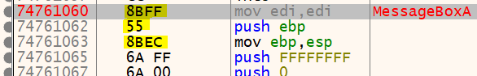
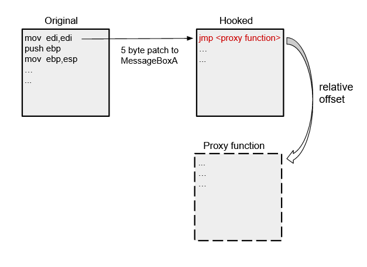
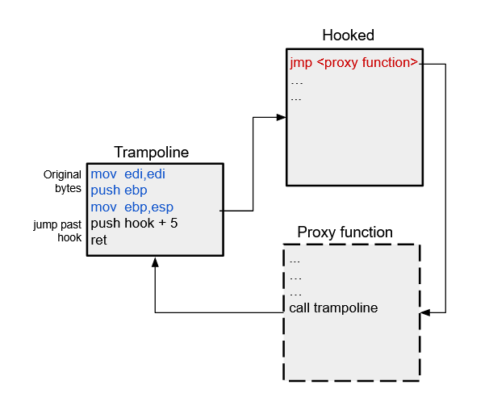

API hooking has been cover exhaustedly over the past decade so this is my attempt at a logical tutorial for the reader and for the purpose of better understanding it myself. This is an important topic in the realm of malware, reverse engineering, and anything involving OS memory.  When paired with process injection, hooking can either give an insight into what an executable attempts to do or maliciously intercept and alter any calls made to the WinAPI. 

#### Background

I will be covering the popular technique of in-line hooking. This method simply attempts to replace the beginning few bytes of an exported function from a DLL loaded and used by the targeted executable/process. The overwrite will in some way jump to a memory location inside the process that you control. From there its up to you to decide what happens with the intercepted call. You could for example, hook CreateFile and once a call is intercepted, just drop it and return unsuccessfully. The effect in this example would be denying access to creating files, or if more targeted, denying access to only certain files.

Its easy to envision the usefulness of this powerful technique. There has been a lot of development using various hooking methods, including in game cheats, Anti-Virus/EDR, and malware. This guide is oriented for userland hooking and seeks to provide you the core understanding of how it all works through a simple example.

#### The classic 5 byte hook

We will be hooking the [MessageBoxA](https://docs.microsoft.com/en-us/windows/win32/api/winuser/nf-winuser-messageboxa) function by replacing its first 5 bytes with a `jmp` instruction to our own function. The MessageBoxA function simply displays a pop up text box with a title and dialog. By hooking it we will be able to intercept calls and alter the arguments.

 {: .align-center}

Here I have disassembled `user32.dll` and found the function we would like to hook. The highlighted 5 bytes correspond to the assembly instructions directly to the right. This set of instructions is a fairly typical prologue found in many API functions.

By overwriting these first 5 bytes with a `jmp` instruction, we are redirecting execution to our own defined function. We will save the original bytes so that they can be referenced later when we want to pass execution back to the hooked function.

The `jmp` instruction is a relative jump to an offset starting from the next instruction's address. The corresponding `jmp` opcode is `E9` and it takes a 4 byte offset that we will need to calculate. 

 {: .align-center}

Lets first get the address of MessageBoxA in memory.

```c++
// 1. get memory address of the MessageBoxA function from user32.dll 
hinstLib= LoadLibraryA(TEXT("user32.dll"));
function_address= GetProcAddress(hinstLib, "MessageBoxA");
```

We are using a technique called dynamic linking where we load the DLL that contains the function we want, using [LoadLibraryA](https://docs.microsoft.com/en-us/windows/win32/api/libloaderapi/nf-libloaderapi-loadlibrarya). Then [GetProcAddress](https://docs.microsoft.com/en-us/windows/win32/api/libloaderapi/nf-libloaderapi-getprocaddress) will give us the address of the function in memory. We can now save the first 5 bytes at the address we found into a buffer using [ReadProcessMemory](https://docs.microsoft.com/en-us/windows/win32/api/memoryapi/nf-memoryapi-readprocessmemory).

```c++
// 2. save the first 5 bytes into saved_buffer
ReadProcessMemory(GetCurrentProcess(), function_address, saved_buffer, 5, NULL);
```

Before we write our patch in, we need to calculate the offset (distance) from MessageBoxA to a proxy function that we will write in a sec. The `jmp <offset>` instruction will essentially move the instruction pointer (EIP) past the current instruction (5 bytes) and then add the offset: `eip = eip + 5 + offset`

Find the offset: `offset = <destination address> - (<source address> + 5)`

```c++
proxy_address= &proxy_function;
src= (DWORD)function_address + 5; 
dst= (DWORD)proxy_address;
relative_offset= (DWORD *)(dst-src);
```

Here is the complete implementation which then writes the patch to MessageBoxA in memory

```c++
void install_hook()
{
    HINSTANCE hinstLib;
    VOID *proxy_address;
    DWORD *relative_offset;
    DWORD src; 
    DWORD dst;
    CHAR patch[5]= {0};

    // 1. get memory address of the MessageBoxA function from user32.dll 
    hinstLib= LoadLibraryA(TEXT("user32.dll"));
    function_address= GetProcAddress(hinstLib, "MessageBoxA");

    // 2. save the first 5 bytes into saved_buffer
    ReadProcessMemory(GetCurrentProcess(), function_address, saved_buffer, 5, NULL);

    // 3. overwrite the first 5 bytes with a call to proxy_function
    proxy_address= &proxy_function;
    src= (DWORD)function_address + 5; 
    dst= (DWORD)proxy_address;
    relative_offset= (DWORD *)(dst-src); 

    memcpy(patch, 1, "\xE9", 1);
    memcpy(patch + 1, 4, &relative_offset, 4);

    WriteProcessMemory(GetCurrentProcess(), (LPVOID)function_address, patch, 5, NULL);
}
```

**Quick note: WriteProcessMemory and ReadProcessMemory query the protections on the memory they are accessing and alter them accordingly. They really want you to succeed :)* 

The proxy function that we redirect execution to will need to accept the same parameters, have the same calling convention, and return the same type that MessageBoxA does.

```c++
// The proxy function we will jump to after the hook has been installed
int __stdcall proxy_function(HWND hWnd, LPCSTR lpText, LPCSTR lpCaption, UINT uType)
```

Now we can print out the parameters meant for MessageBoxA, alter them, and then continue to the real MessageBoxA. If we just call MessageBoxA we will run into the hook again causing infinite recursion and a stack overflow. To prevent this we will first replace the bytes we overwrote with the original ones that were previously saved into a buffer. 

```c++
// The proxy function we will jump to after the hook has been installed
int __stdcall proxy_function(HWND hWnd, LPCSTR lpText, LPCSTR lpCaption, UINT uType)
{
    std::cout << "Hello from MessageBox!\n";
    std::cout << "Text: " << (LPCSTR)lpText << "\nCaption: " << (LPCSTR)lpCaption << "\n";

    // unhook the function (re-write the saved buffer) to prevent infinite recursion
    WriteProcessMemory(GetCurrentProcess(), (LPVOID)hooked_address, saved_buffer, 5, NULL);

    // return to the original function and modify the intended parameters
    return MessageBoxA(NULL, "yeet", "yeet", uType);
}
```

This hook will only effect a call to MessageBoxA from within the same program. To tamper with another processes functions from imported DLLs would require injection, which will be covered in the next part. View this example on [github](https://github.com/jayo78/basic-hooking/blob/master/hook_v1.cpp).

Since the proxy function re-writes the original bytes, which unhooks the function, we would need to continually hook MessageBoxA to intercept subsequent calls. Lets talk trampolines. 

#### Trampolines

We can use a trampoline function to keep our hook intact while not causing infinite recursion. The trampoline's job is to execute the original bytes from function that we hooked and then jump past the installed hook. We can call it from the proxy function.

 {: .align-center}

By jumping 5 bytes past the original function's address we are not executing the relative `jmp` to the proxy function, by passing the installed hook. 

We are pushing the address of the hooked function + 5 and then using `ret` to jump to that address. These two instructions, which use a 4 byte address, total to 6 bytes. Our trampoline then will be 11 bytes. Lets build the trampoline by adding to the `install_hook()` function we already wrote.

```c++
void install_hook()
{
    HINSTANCE hinstLib;
    VOID *proxy_address;
    DWORD *relative_offset;
    DWORD *hook_address;
    DWORD src; 
    DWORD dst;
    CHAR patch[5]= {0};
    char saved_buffer[5]; // buffer to save the original bytes
    FARPROC function_address= NULL;

    // 1. get memory address of the MessageBoxA function from user32.dll 
    hinstLib= LoadLibraryA(TEXT("user32.dll"));
    function_address= GetProcAddress(hinstLib, "MessageBoxA");

    // 2. save the first 5 bytes into saved_buffer
    ReadProcessMemory(GetCurrentProcess(), function_address, saved_buffer, 5, NULL);

    // 3. overwrite the first 5 bytes with a jump to proxy_function
    proxy_address= &proxy_function;
    src= (DWORD)function_address + 5; 
    dst= (DWORD)proxy_address;
    relative_offset= (DWORD *)(dst-src); 

    memcpy(patch, "\xE9", 1);
    memcpy(patch + 1, &relative_offset, 4);

    WriteProcessMemory(GetCurrentProcess(), (LPVOID)function_address, patch, 5, NULL);

    // 4. Build the trampoline
    trampoline_address= VirtualAlloc(NULL, 11, MEM_COMMIT, PAGE_EXECUTE_READWRITE);
    hook_address= (DWORD *)((DWORD)function_address + 5);
    memcpy((BYTE *)trampoline_address, &saved_buffer, 5);
    memcpy((BYTE *)trampoline_address + 5, "\x68", 1);
    memcpy((BYTE *)trampoline_address + 6, &hook_address, 4);
    memcpy((BYTE *)trampoline_address + 10, "\xC3", 1);
}
```

We first call [VirtualAlloc](https://docs.microsoft.com/en-us/windows/win32/api/memoryapi/nf-memoryapi-virtualalloc) to allocate 11 bytes of memory. We need to specify the protection of this memory location as executable, readable, and writable. This will allow us to edit the allocated bytes and then later execute them. After writing the trampoline to memory we can call it from the proxy function. Here is a function definition that we can call after assigning it to a memory location. It has the same parameters as MessageBoxA.

```c++
typedef 
int (WINAPI *defTrampolineFunc)(HWND hWnd, LPCSTR lpText, LPCSTR lpCaption, UINT uType);

```

Using the above definition, the proxy function can now call the previously allocated trampoline code.

```c++
// The proxy function we will jump to after the hook has been installed
int __stdcall proxy_function(HWND hWnd, LPCSTR lpText, LPCSTR lpCaption, UINT uType)
{
    std::cout << "----------intercepted call to MessageBoxA----------\n";
    std::cout << "Text: " << (LPCSTR)lpText << "\nCaption: " << (LPCSTR)lpCaption << "\n";

    // pass to the trampoline with altered arguments which will then return to MessageBoxA
    defTrampolineFunc trampoline= (defTrampolineFunc)trampoline_address;
    return trampoline(hWnd, "yeet", "yeet", uType);
}
```

View the full example on [github](https://github.com/jayo78/basic-hooking/blob/master/hook_v2.cpp).

#### Conclusion

We covered a simple 5 byte - relative jump hook that should have given you a taste of what hooks are and how they can be useful. There are many ways to implement hooks, some more complicated than others. Please see [here](http://jbremer.org/x86-api-hooking-demystified/) for more hooking examples. 
