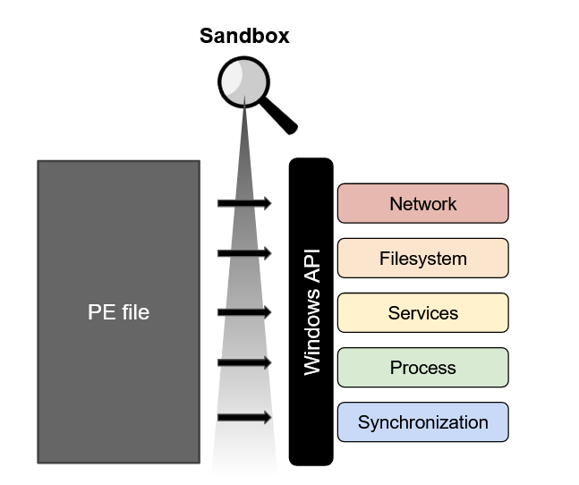

In this 2 part series I will walk through creating a simple userland sandbox that is able to peak inside the functionality of a windows executable. It does this by injecting a monitor DLL, whos job is to install inline API hooks that intercept and report any calls made by the executable. This type of software is widely used to examine malicious programs dynamically or ensure a secure execution environment when dealing with untrusted users. By building your own sandbox you will be introduced to some really cool memory hacking techniques seen in malware and game cheats. This project is easily adaptable and I suggest the reader implement their own design.

#### Prerequisites and Resources

You will need to understand:

- [DLLs](https://support.microsoft.com/en-us/help/815065/what-is-a-dll), [Windows processes and threads](https://docs.microsoft.com/en-us/windows/win32/procthread/processes-and-threads), [PE file format](https://docs.microsoft.com/en-us/windows/win32/debug/pe-format)
- Windows API hooking - see resources below or my blog post "WinAPI Hooking Basics"
- C/C++, basic x86, debugging

Resources I used:

- [dissecting inline hooks](http://www.binaryguard.com/bgc/malware/sandbox/2015/11/09/dissecting_inline_hooks.html)
- [x86 api hooking demystified](http://jbremer.org/x86-api-hooking-demystified/)
- [inline hooking for programmers](https://www.malwaretech.com/2015/01/inline-hooking-for-programmers-part-1.html)

#### So what is a sandbox?

A sandbox is designed to examine the behavior of an executable and is largely used in Cybersecurity solutions for analyzing malware. There are a few open source projects like [Cuckoo](https://cuckoosandbox.org/). 

The idea is to run a program in a controlled environment to see what it attempts to do. A native executable will need to reach out to the host operating system in order to have any functionality. For example, it might need to manipulate a file using the I/O functions or use sockets to connect to remote servers. In order to intercept these calls to the operating system, a userland sandbox will need to sit in the middle of this communication.

We will be building a sandbox for Windows executables, which have the PE file [format](https://docs.microsoft.com/en-us/windows/win32/debug/pe-format). The Windows API (win32 API) allows for userland programs to interact with the Windows OS by providing functions in shared libraries called *Dynamically Linked Libraries*. The sandbox will need to monitor these functions.

{: .align-center}

Since every process essentially has their very own copy of Windows DLLs needed to execute, our sandbox will need to be injected into the executable's process that we want to examine. Once injected the sandbox can insert changes known as *hooks* into the imported DLL functions that will now be used by the executable. 

I will focus my attention on the actual implementation of injecting and installing hooks. There are extensive recourses out there that do a better job than I would at explaining topics like processes, threads, OS internals, etc. I used many resources that I'll share and I encourage the reader to extend your own research beyond this article where you find gaps in knowledge. 

#### Process Injection

Processes are more than a space for a program to execute in. There is a lot of behind the scenes work done by the Windows OS in terms of the security of a program, communication with other processes, and access to shared recourses. The birth of a process involves the mapping of a program's memory on disk to virtual memory where it can begin executing. Windows separates address spaces using virtualization so they don't bump into each other's memory and so it can easily interface with each one individually - read [here](https://answers.microsoft.com/en-us/windows/forum/windows_10-performance/physical-and-virtual-memory-in-windows-10/e36fb5bc-9ac8-49af-951c-e7d39b979938?auth=1). 

Knowing this OS functionality we can now begin looking at ways a process can access another processes memory using functions provided by the Windows API. I highly recommend checking out this [post](https://www.elastic.co/blog/ten-process-injection-techniques-technical-survey-common-and-trending-process) on common process injection techniques. There are more in depth articles out there outlining many injection methods - see [here](https://i.blackhat.com/USA-19/Thursday/us-19-Kotler-Process-Injection-Techniques-Gotta-Catch-Them-All-wp.pdf) - but for our sandbox we will be using [DLL injection](http://blog.opensecurityresearch.com/2013/01/windows-dll-injection-basics.html). 

We first need to open the executable we would like to examine, using [CreateProcess](https://docs.microsoft.com/en-us/windows/win32/api/processthreadsapi/nf-processthreadsapi-createprocessa). This function lets us create a child process in a suspended, which will now let us inject and install hooks before resuming its main thread. We can utilize [CreateRemoteThread](https://docs.microsoft.com/en-us/windows/win32/api/processthreadsapi/nf-processthreadsapi-createremotethread) and [LoadLibraryA](https://docs.microsoft.com/en-us/windows/win32/api/libloaderapi/nf-libloaderapi-loadlibrarya) to load our hooking DLL into the process. 

{: .align-center}

Here you can see the two components: the injector and the DLL that will be injected. The injector creates the process in suspended state and then starts a remote thread inside the new process. This remote thread then calls out to LoadLibrary which loads our DLL into the process space where we can start installing hooks.

#### The Injector

Coding our own injector is actually quite simple, here is a snippet that shows what the diagram above depicts:

```c++
/*
** Create the process as suspended - main thread created but no DLLs loaded
*/
if (!CreateProcess(NULL, targetExe, NULL, NULL, FALSE, CREATE_SUSPENDED, NULL, NULL, &si, &pi)) 
    {
        std::cout << "CreateProcess failed: " << GetLastError() << "\n";
        return 1;
    }

/* 
** inject the process that we created 
*/
    inject_DLL(dllPath, pi.hProcess);

/*
** Resume the suspended process now with our DLL injected
*/
    ResumeThread(pi.hThread);
    WaitForSingleObject( pi.hProcess, INFINITE );
    CloseHandle( pi.hProcess );
    CloseHandle( pi.hThread );

    return 0;

```

Lets take a look at our defined `inject_DLL` function. It takes the path to our DLL that we would like to inject and a handle to the process we created. To start out we will need the LoadLibrary function address, which can be found inside the kernel32 library, `kernel32.dll`.

```c++
kernel32= GetModuleHandle(_T("kernel32.dll"));
loadlibrary= GetProcAddress(kernel32, _T("LoadLibraryA"));
```

Its important to point out here that the LoadLibraryA function will always be loaded at the same address in each process. This means we can find the address in our injector process and it will be the same when executing in our remote thread. Now we must allocate and write a patch to the remote process so we can start a thread at that address.

```c++
lpBaseAddress= VirtualAllocEx(process, NULL, pathLen, MEM_COMMIT | MEM_RESERVE, PAGE_READWRITE);
if (lpBaseAddress == NULL)
	std::cout << "VirtualAllocEx failed: " << GetLastError() << "\n";

if (!WriteProcessMemory(process, lpBaseAddress, dllPath, pathLen, NULL))
	std::cout << "WriteProcessMemory failed: " << GetLastError() << "\n";
```

We are using [VirtualAllocEx](https://docs.microsoft.com/en-us/windows/win32/api/memoryapi/nf-memoryapi-virtualallocex) and then [WriteProcessMemory](https://docs.microsoft.com/en-us/windows/win32/api/memoryapi/nf-memoryapi-writeprocessmemory) to write the full path of our DLL that we would like to inject into the process.  When creating our remote thread we can specify a startup routine - a function that exists inside the process - that will use the DLL path as an argument.  

```c++
hRemoteThread= CreateRemoteThread(process, NULL, 0, (LPTHREAD_START_ROUTINE)(VOID *)loadlibrary, lpBaseAddress, NULL, 0);
if (hRemoteThread == NULL)
    std::cout << "CreateRemoteThread failed: " << GetLastError() << "\n";
```

Since we know the address of LoadLibrary we can use it as a startup routine to load our DLL path. Now that its loaded, our DLL will begin to execute at a defined entry point. Here is the full function:

```c++
void inject_DLL(TCHAR *dllPath, HANDLE process)
{
/*
** Variable declarations
*/
    LPVOID lpBaseAddress;
    HANDLE hRemoteThread;
    HMODULE kernel32;
    FARPROC loadlibrary;
    SIZE_T pathLen;
    
/*
** Initialize variables
*/
    lpBaseAddress= NULL;
    hRemoteThread= NULL;
    loadlibrary= NULL; 
    kernel32= NULL;
    pathLen= _tcslen(dllPath) * sizeof(TCHAR);

    kernel32= GetModuleHandle(_T("kernel32.dll"));
    loadlibrary= GetProcAddress(kernel32, _T("LoadLibraryA"));

/*
** Allocate memory and write the dll path that will be injected
*/
    lpBaseAddress= VirtualAllocEx(process, NULL, pathLen, MEM_COMMIT | MEM_RESERVE, PAGE_READWRITE);
    if (lpBaseAddress == NULL)
        std::cout << "VirtualAllocEx failed: " << GetLastError() << "\n";
    
    if (!WriteProcessMemory(process, lpBaseAddress, dllPath, pathLen, NULL))
        std::cout << "WriteProcessMemory failed: " << GetLastError() << "\n";

/*
** Create a thread that will load the dll path using LoadLibrary as a start up routine
*/ 
    hRemoteThread= CreateRemoteThread(process, NULL, 0, (LPTHREAD_START_ROUTINE)(VOID *)loadlibrary, lpBaseAddress, NULL, 0);
    if (hRemoteThread == NULL)
        std::cout << "CreateRemoteThread failed: " << GetLastError() << "\n";

/*
** Clean up
*/
    WaitForSingleObject(hRemoteThread, INFINITE);
    CloseHandle(hRemoteThread);
}
```

#### Hooking from within

The injected DLL will need to install hooks from inside the target process, so lets look at how DLLs can be developed. DLLs can be attached to by a process and its threads in order to execute needed functionality, usually through an exported function. A normal use would be to call `LoadLibrary` on the DLL to get a handle and then `GetProcAddress` to find the desired exported function. The point of the switch cases, seen in `DllMain` below, is so the developer has a chance to set up structures/internals before an exported function is called. We won't be exporting functions but will instead do our hooking from the entry point, which isn't necessarily good [practice](https://docs.microsoft.com/en-us/windows/win32/dlls/dynamic-link-library-best-practices).

For a quick demo we will use the same MessageBoxA hook from ["WinAPI Hooking Basics"](https://github.com/jayo78/basic-hooking/blob/master/hook_v2.cpp), but this time it will be injected by our injector into a sample program.

```c
#include <iostream>
#include <Windows.h>

#pragma comment(lib,"user32.lib")

typedef int (WINAPI *defTrampolineFunc)(HWND hWnd, LPCSTR lpText, LPCSTR lpCaption, UINT uType);
LPVOID trampoline_address; 

// The proxy function we will jump to after the hook has been installed
int __stdcall proxy_function(HWND hWnd, LPCSTR lpText, LPCSTR lpCaption, UINT uType)
{
    std::cout << "----------intercepted call to MessageBoxA----------\n";
    std::cout << "Text: " << (LPCSTR)lpText << "\nCaption: " << (LPCSTR)lpCaption << "\n";

    // pass to the trampoline with altered arguments which will then return to MessageBoxA
    defTrampolineFunc trampoline= (defTrampolineFunc)trampoline_address;
    return trampoline(hWnd, "yeet", "yeet", uType);
}

void install_hook()
{
    HINSTANCE hinstLib;
    VOID *proxy_address;
    DWORD *relative_offset;
    DWORD *hook_address;
    DWORD src; 
    DWORD dst;
    CHAR patch[5]= {0};
    char saved_buffer[5]; // buffer to save the original bytes
    FARPROC function_address= NULL;

    // 1. get memory address of the MessageBoxA function from user32.dll 
    hinstLib= LoadLibraryA(TEXT("user32.dll"));
    function_address= GetProcAddress(hinstLib, "MessageBoxA");

    // 2. save the first 5 bytes into saved_buffer
    ReadProcessMemory(GetCurrentProcess(), function_address, saved_buffer, 5, NULL);

    // 3. overwrite the first 5 bytes with a jump to proxy_function
    proxy_address= &proxy_function;
    src= (DWORD)function_address + 5; 
    dst= (DWORD)proxy_address;
    relative_offset= (DWORD *)(dst-src); 

    memcpy(patch, "\xE9", 1);
    memcpy(patch + 1, &relative_offset, 4);

    WriteProcessMemory(GetCurrentProcess(), (LPVOID)function_address, patch, 5, NULL);

    // 4. Build the trampoline
    trampoline_address= VirtualAlloc(NULL, 11, MEM_COMMIT, PAGE_EXECUTE_READWRITE);
    hook_address= (DWORD *)((DWORD)function_address + 5);
    memcpy((BYTE *)trampoline_address, &saved_buffer, 5);
    memcpy((BYTE *)trampoline_address + 5, "\x68", 1);
    memcpy((BYTE *)trampoline_address + 6, &hook_address, 4);
    memcpy((BYTE *)trampoline_address + 10, "\xC3", 1);
}

BOOL WINAPI DllMain (HINSTANCE const instance, DWORD const reason, LPVOID const reserved)  
{
    switch (reason)
    {
        case DLL_PROCESS_ATTACH:
            MessageBoxA(NULL, "process attached", "Monitor", MB_OK);
            MessageBoxA(NULL, "installing hook", "Monitor", MB_OK);
            install_hook();
            break;

        case DLL_THREAD_ATTACH:
        case DLL_PROCESS_DETACH:
        case DLL_THREAD_DETACH:
            break;
    }
    return TRUE;  
}
```

`DllMain` is called upon a process/thread attach or detach and is the DLL's entry point. `LoadLibrary` triggers this entry point and will execute the code in the `DLL_PROCESS_ATTACH` case, see [here](https://docs.microsoft.com/en-us/previous-versions/windows/desktop/mscs/implementing-dllmain). 

We'll inject it into a simple test program that you will need to compile:

```c++
#include <windows.h>
#pragma comment(lib,"user32.lib")
int main()
{
    MessageBoxA(NULL, "hello", "hello", MB_OK);
}
```

To inject into the compiled executable using the injector we first need to compile our DLL code to an actual DLL. Executables (.exe extension) and DLLs (.dll extension) share the same PE file format but serve different [purposes](https://stackoverflow.com/questions/1210873/difference-between-dll-and-exe) and are compiled differently. I use Microsoft's compiler, [MSVC](https://docs.microsoft.com/en-us/cpp/build/reference/compiler-options?view=vs-2019) from the [command line](https://docs.microsoft.com/en-us/cpp/build/building-on-the-command-line?view=vs-2019). To compile a DLL we must specify the [/LD](https://docs.microsoft.com/en-us/cpp/build/reference/md-mt-ld-use-run-time-library?view=vs-2019) option.

Once we have our DLL, use the injector (injector.exe) like so: `injector.exe <test.exe> <path to DLL>`. View the injector and DLL code on [github](https://github.com/jayo78/basic-hooking/tree/master/injection).

#### Conclusion

In this first of two posts on building a sandbox, we walked through DLL injection for the purpose of installing hooks into a remote process. Don't worry, we will be hooking much more than MessageBoxA. In part 2 we will implement the minhook library as a hooking engine to hook and monitor a wide variety of windows functions. 
