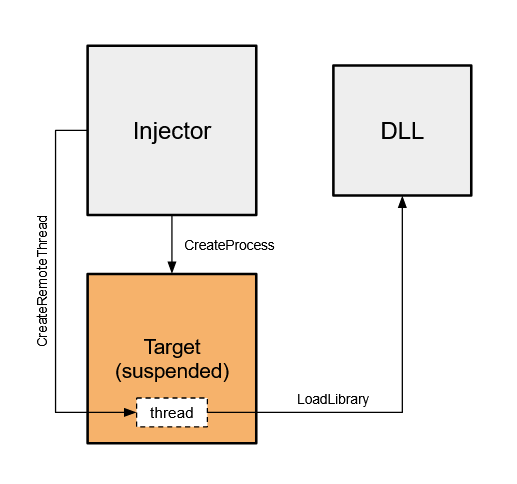

In part 2 of building a userland sandbox I will be walking through injecting hooks into a remote process in order to intercept a target executable's calls to the Windows API. Refer to [part 1](https://jayo78.github.io/Sandbox-part-1-hooking-basics/) for a more in-depth explanation of a sandbox. In this part we will see a more complete example of sandbox functionality using process injection. We will first be implementing a simple injector using the CreateRemoteThread + LoadLibrary DLL injection technique which has been thoroughly covered online and used for years. The hooks we created in part 1 will now be used to hook a remote processes calls. Then in Part 3 we finish up by implementing an open source hooking library and developing a mini logger class for logging the information we get from an intercepted call. 

I will focus my attention on the actual implementation of injecting and installing hooks. There are extensive recourses out there that do a better job than I would at explaining topics like processes, threads, OS internals, etc. I used many resources that I'll share and I encourage the reader to extend your own research beyond this article where you find gaps in knowledge. Lets get into it!

#### Overview

Processes are more than a space for a program to execute in. There is a lot of behind the scenes work done by the Windows OS in terms of the security of a program, communication with other processes, and access to shared recourses. The birth of a process involves the mapping of a program's memory on disk to virtual memory where it can begin executing. Windows separates address spaces using virtualization so they don't bump into each other's memory and so it can easily interface with each one individually - read [here](https://answers.microsoft.com/en-us/windows/forum/windows_10-performance/physical-and-virtual-memory-in-windows-10/e36fb5bc-9ac8-49af-951c-e7d39b979938?auth=1). 

Knowing this OS functionality we can now begin looking at ways a process can access another processes memory using functions provided by the Windows API. I highly recommend checking out this [post](https://www.elastic.co/blog/ten-process-injection-techniques-technical-survey-common-and-trending-process) on common process injection techniques. There are more in depth articles out there outlining many injection methods - see [here](https://i.blackhat.com/USA-19/Thursday/us-19-Kotler-Process-Injection-Techniques-Gotta-Catch-Them-All-wp.pdf) - but for our sandbox we will be using [DLL injection](http://blog.opensecurityresearch.com/2013/01/windows-dll-injection-basics.html). 

We first need to open the executable we would like to examine, using [CreateProcess](https://docs.microsoft.com/en-us/windows/win32/api/processthreadsapi/nf-processthreadsapi-createprocessa). This function lets us create a child process in a suspended, which will now let us inject and install hooks before resuming its main thread. We can utilize [CreateRemoteThread](https://docs.microsoft.com/en-us/windows/win32/api/processthreadsapi/nf-processthreadsapi-createremotethread) and [LoadLibraryA](https://docs.microsoft.com/en-us/windows/win32/api/libloaderapi/nf-libloaderapi-loadlibrarya) to load our hooking DLL into the process. 

{: .align-center}

Here you can see the two components: the injector and the DLL that will be injected. The injector creates the process in suspended state and then starts a remote thread inside the new process. This remote thread then calls out to LoadLibrary which loads our DLL into the process space where we can start installing hooks.

#### The Injector

Coding our own injector is actually quite simple, here is a snippet that shows what the diagram above depicts:

```c++
/*
** Create the process as suspended - main thread created but no DLLs loaded
*/
if (!CreateProcess(NULL, targetExe, NULL, NULL, FALSE, CREATE_SUSPENDED, NULL, NULL, &si, &pi)) 
    {
        std::cout << "CreateProcess failed: " << GetLastError() << "\n";
        return 1;
    }

/* 
** inject the process that we created 
*/
    inject_DLL(dllPath, pi.hProcess);

/*
** Resume the suspended process now with our DLL injected
*/
    ResumeThread(pi.hThread);
    WaitForSingleObject( pi.hProcess, INFINITE );
    CloseHandle( pi.hProcess );
    CloseHandle( pi.hThread );

    return 0;
}
```

Lets take a look at our defined `inject_DLL` function. It takes the path to our DLL that we would like to inject and a handle to the process we created. To start out we will need the LoadLibrary function address, which can be found inside the kernel32 library, `kernel32.dll`.

```c++
kernel32= GetModuleHandle(_T("kernel32.dll"));
loadlibrary= GetProcAddress(kernel32, _T("LoadLibraryA"));
```

Its important to point out here that the LoadLibraryA function will always be loaded at the same address in each process. This means we can find the address in our injector process and it will be the same when executing in our remote thread. Now we must allocate and write a patch to the remote process so we can start a thread at that address.

```c++
lpBaseAddress= VirtualAllocEx(process, NULL, pathLen, MEM_COMMIT | MEM_RESERVE, PAGE_READWRITE);
if (lpBaseAddress == NULL)
	std::cout << "VirtualAllocEx failed: " << GetLastError() << "\n";

if (!WriteProcessMemory(process, lpBaseAddress, dllPath, pathLen, NULL))
	std::cout << "WriteProcessMemory failed: " << GetLastError() << "\n";
```

We are using [VirtualAllocEx](https://docs.microsoft.com/en-us/windows/win32/api/memoryapi/nf-memoryapi-virtualallocex) and then [WriteProcessMemory](https://docs.microsoft.com/en-us/windows/win32/api/memoryapi/nf-memoryapi-writeprocessmemory) to write the full path of our DLL that we would like to inject into the process.  When creating our remote thread we can specify a startup routine - a function that exists inside the process - that will use the DLL path as an argument.  

```c++
hRemoteThread= CreateRemoteThread(process, NULL, 0, (LPTHREAD_START_ROUTINE)(VOID *)loadlibrary, lpBaseAddress, NULL, 0);
if (hRemoteThread == NULL)
    std::cout << "CreateRemoteThread failed: " << GetLastError() << "\n";
```

Since we know the address of LoadLibrary we can use it as a startup routine to load our DLL path. Now that its loaded, our DLL will begin to execute at a defined entry point. Here is the full function:

```c++
void inject_DLL(TCHAR *dllPath, HANDLE process)
{
/*
** Variable declarations
*/
    LPVOID lpBaseAddress;
    HANDLE hRemoteThread;
    HMODULE kernel32;
    FARPROC loadlibrary;
    SIZE_T pathLen;
    
/*
** Initialize variables
*/
    lpBaseAddress= NULL;
    hRemoteThread= NULL;
    loadlibrary= NULL; 
    kernel32= NULL;
    pathLen= _tcslen(dllPath) * sizeof(TCHAR);

    kernel32= GetModuleHandle(_T("kernel32.dll"));
    loadlibrary= GetProcAddress(kernel32, _T("LoadLibraryA"));

/*
** Allocate memory and write the dll path that will be injected
*/
    lpBaseAddress= VirtualAllocEx(process, NULL, pathLen, MEM_COMMIT | MEM_RESERVE, PAGE_READWRITE);
    if (lpBaseAddress == NULL)
        std::cout << "VirtualAllocEx failed: " << GetLastError() << "\n";
    
    if (!WriteProcessMemory(process, lpBaseAddress, dllPath, pathLen, NULL))
        std::cout << "WriteProcessMemory failed: " << GetLastError() << "\n";

/*
** Create a thread that will load the dll path using LoadLibrary as a start up routine
*/ 
    hRemoteThread= CreateRemoteThread(process, NULL, 0, (LPTHREAD_START_ROUTINE)(VOID *)loadlibrary, lpBaseAddress, NULL, 0);
    if (hRemoteThread == NULL)
        std::cout << "CreateRemoteThread failed: " << GetLastError() << "\n";

/*
** Clean up
*/
    WaitForSingleObject(hRemoteThread, INFINITE);
    CloseHandle(hRemoteThread);
}
```

#### Hooking from within

The injected DLL will need to all the hooking from inside the target process, so lets look at how DLLs can be developed. DLLs can be attached to by a process and its threads in order to execute needed functionality, usually through an exported function. A normal use would be to call `LoadLibrary` on the DLL to get a handle and then `GetProcAddress` to find the desired exported function. The point of the switch cases, seen below, is so the developer has a chance to set up structures/internals before an exported function is called. We won't be exporting functions but will instead do our hooking from the entry point, which isn't necessarily good [practice](https://docs.microsoft.com/en-us/windows/win32/dlls/dynamic-link-library-best-practices):

```c++
BOOL WINAPI DllMain (HINSTANCE const instance, DWORD const reason, LPVOID const reserved)  
{
    switch (reason)
    {
        case DLL_PROCESS_ATTACH:
            MessageBoxA(NULL, "process attached", "Monitor", MB_OK);
            MessageBoxA(NULL, "installing hook", "Monitor", MB_OK);
            install_hook();
            break;

        case DLL_THREAD_ATTACH:
        case DLL_PROCESS_DETACH:
        case DLL_THREAD_DETACH:
            break;
    }
    return TRUE;  
}
```

`DllMain` is called upon a process/thread attach or detach and is the DLL's entry point. `LoadLibrary` triggers this entry point and will execute the code in the `DLL_PROCESS_ATTACH` case, see [here](https://docs.microsoft.com/en-us/previous-versions/windows/desktop/mscs/implementing-dllmain). 

For a quick demo we will use the same MessageBoxA hook from [part 1](https://github.com/jayo78/basic-hooking/blob/master/hook_v2.cpp) but now we'll inject it into a simple test program that you will need to compile:

```c++
#include <windows.h>
#pragma comment(lib,"user32.lib")
int main()
{
    MessageBoxA(NULL, "hello", "hello", MB_OK);
}
```

To inject into the compiled executable using the injector we first need to compile our DLL code to an actual DLL. Executables (.exe extension) and DLLs (.dll extension) share the same PE file format but serve different [purposes](https://stackoverflow.com/questions/1210873/difference-between-dll-and-exe) and are compiled differently. I use Microsoft's compiler, [MSVC](https://docs.microsoft.com/en-us/cpp/build/reference/compiler-options?view=vs-2019) from the [command line](https://docs.microsoft.com/en-us/cpp/build/building-on-the-command-line?view=vs-2019). To compile a DLL we must specify the [/LD](https://docs.microsoft.com/en-us/cpp/build/reference/md-mt-ld-use-run-time-library?view=vs-2019) option.

Once we have our DLL, use the injector (injector.exe) like so: `injector.exe <test.exe> <path to DLL>`. View the injector and DLL code on [github](https://github.com/jayo78/basic-hooking/tree/master/injection).

#### Conclusion

In this part 2 of 3 posts on building a sandbox, we walked through DLL injection for the purpose of installing hooks into a remote process. Don't worry, we will be hooking much more than MessageBoxA. In part 3 we will implement the minhook library as a hooking engine to hook and monitor a wide variety of windows functions. 
